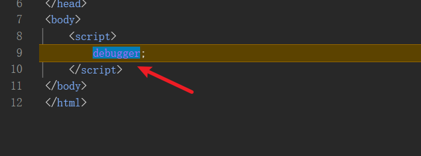

# Bypass_Debugger

## Intro

该脚本可bypass：

1. new Function --> debugger
2. constructor --> debugger
3. eval --> debugger

## 注意事项

1. 本脚本在油猴里的运行时期为`document-start`。

2. 如果发现hook后打开F12依然存在debugger：

- **建议开着F12在刷新一次。** 
- 请检查油猴或其他插件加载的脚本是不是做了同样的操作，例如重写Function等等，个人建议使用时除不是自己写的脚本(指没有做本脚本同样动作的)都关闭。

3. 我的这段Bypass Debugger脚本，目前已知的只有以下这两种情况不能被bypass掉：
```js
var dbg = function (){
    debugger;
}
setInterval(dbg,3000);
```


以及直接将debugger写在script当中的：



以上这两种设条件断点就能过(如果不知道怎么设置条件断点的可以去看一下我之前写的反调试与反反调试一文)，或者替换也行，不需要hook的，所以我就暂时没去管这个。

4. 如果发现hook后站点js出现异常，可以考虑使用备用脚本。

5. Bypass_Debugger和Bypass_Debugger(Proxy)这两个脚本都可以使用，两个脚本的区别就是Bypass_Debugger(Proxy)脚本是通过Proxy重写的Function，我的建议是继续使用Bypass_Debugger脚本，Bypass_Debugger(Proxy)脚本可以拿来做学习研究。

## Contact

如有bug或其他问题可提交issues，或者关注公众号Spade sec联系我。
